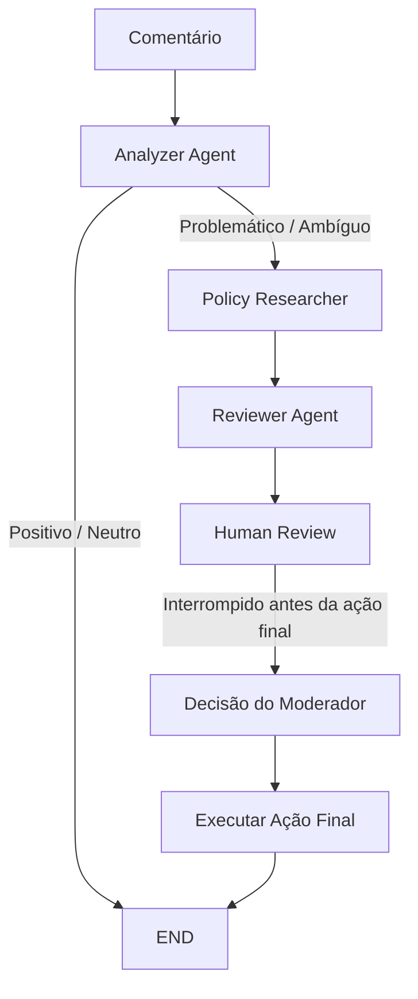

# Content Moderation Agent System


Um workflow multiagente de moderação de conteúdo construído com **LangGraph**, combinando análise automatizada com um ponto de checagem de **Human-in-the-Loop** antes de qualquer decisão final ser aplicada.

---

## Visão Geral

Este projeto implementa um pipeline de moderação para comentários de usuários (com escopo original para uma plataforma de cursos online) utilizando agentes especializados orquestrados como um `StateGraph`. Em vez de um único componente tentar analisar o conteúdo, consultar políticas e decidir uma ação tudo de uma vez, o workflow separa essas responsabilidades em nós distintos que trocam um estado compartilhado entre si.

O sistema também trata a **supervisão humana como parte da arquitetura, não como um complemento**: o grafo é compilado com um ponto de interrupção imediatamente antes da ação final, o estado da execução é persistido em SQLite, e a decisão de um moderador pode ser registrada e usada para retomar a execução.

## Problema

A moderação automática de conteúdo raramente é um problema simples de classificação binária. Uma abordagem de agente único e passagem única enfrenta dificuldades com:

- **Conteúdo ambíguo** — comentários que não se encaixam claramente em "permitido" ou "não permitido".
- **Contexto de políticas** — uma decisão pode depender de diretrizes da comunidade, e não apenas de correspondência de palavras-chave.
- **Risco de ações automáticas incorretas** — remover ou editar conteúdo automaticamente, sem revisão, tem consequências reais.
- **Rastreabilidade** — entender *por que* uma decisão foi tomada, e o que um moderador humano decidiu no fim, importa tanto quanto a decisão em si.

Este projeto explora uma arquitetura que mantém análise, consulta de políticas, recomendação e ação final como **etapas separadas e inspecionáveis**, com um checkpoint humano antes de qualquer coisa irreversível acontecer.

## Solução

O workflow separa responsabilidades entre agentes especializados conectados por roteamento condicional:

```text
Comentário
   │
   ▼
Analyzer Agent
   │
   ├── Positivo / Neutro ───────────────► END (Aprovado)
   │
   └── Problemático / Ambíguo
           │
           ▼
     Policy Researcher
           │
           ▼
        Reviewer
           │
           ▼
   Human Review (workflow interrompido)
           │
           ▼
     Ação Final ──► END
```

- **Analyzer Agent** — classifica o comentário recebido como positivo/neutro, potencialmente problemático ou potencialmente ambíguo.
- **Policy Researcher Agent** — consulta a política de moderação relevante para comentários problemáticos/ambíguos, por meio de uma função de busca conectável (desacoplada de qualquer provedor específico, para facilitar os testes).
- **Reviewer Agent** — consolida a análise e o contexto de políticas em uma recomendação (`Aprovado`, `Remover` ou `Editar`) com justificativa.
- **Human Review** — o grafo pausa exatamente antes do nó de ação final, para que um moderador possa inspecionar o estado completo e registrar uma decisão.
- **Ação Final** — é executada após o checkpoint humano, encerrando a execução.

Comentários classificados como positivos ou neutros pulam completamente a pesquisa de políticas e a revisão, saindo do grafo imediatamente e evitando chamadas desnecessárias a agentes.

## Arquitetura



O grafo é construído com `StateGraph(AgentState)`, usando `set_entry_point("analyzer")`, uma aresta condicional (`add_conditional_edges`) após o Analyzer, e um caminho linear de Policy Researcher → Reviewer → Ação Final. O detalhamento técnico completo — incluindo o formato do estado durante a pausa e o mecanismo de retomada — está em [`docs/architecture/human-in-the-loop.md`](docs/architecture/human-in-the-loop.md).

## Multi-Agent Workflow

Dividir o pipeline em agentes especializados em vez de uma função monolítica foi uma escolha deliberada:

- **Responsabilidade única** — cada agente (`Analyzer`, `Policy Researcher`, `Reviewer`) tem uma função claramente definida, construída sobre um contrato compartilhado `BaseAgent`.
- **Testabilidade independente** — cada agente possui seus próprios testes unitários, e a lógica de roteamento do grafo é testada separadamente dos agentes em si.
- **Fluxo de controle explícito** — as decisões de roteamento (`route_after_analysis`) são uma função simples, não algo escondido dentro de um agente, o que facilita entender e testar a lógica de ramificação.
- **Extensibilidade** — o `PolicyResearcher` já aceita uma `search_fn` injetável, então substituir a busca atual baseada em regras por uma integração de busca real (ou baseada em LLM) não exige alterar o grafo.
- **Rastreabilidade** — cada etapa escreve no mesmo `AgentState`, então o histórico completo de uma decisão (o que foi analisado, qual política se aplicou, o que foi recomendado, o que o humano decidiu) fica disponível em um único lugar.

## Human-in-the-Loop

A supervisão humana é parte central do fluxo de controle, não uma interface colocada por cima dele.

O grafo é compilado com:

```python
workflow.compile(
    checkpointer=checkpointer,
    interrupt_before=["executar_acao_final"],
)
```

Isso significa que todas as etapas até (e incluindo) a recomendação do Reviewer são executadas automaticamente, mas a execução **pausa antes da ação final** para que um moderador possa inspecionar o estado acumulado — o comentário original, a análise, o contexto de políticas e a recomendação — antes que qualquer coisa seja finalizada.

A decisão do moderador é capturada por uma interface de revisão dedicada (`display_review` / `request_human_decision` / `collect_human_review`) e gravada de volta no estado compartilhado como `decisao_humana` e `observacao_humana`. Como o estado é persistido via checkpoint, o workflow pode ser retomado depois usando o mesmo `thread_id`, continuando exatamente de onde parou.

Esta é uma das partes mais testadas do sistema, cobrindo aprovação, rejeição, roteamento de comentários ambíguos e preservação do comentário original durante todo o ciclo. Detalhes completos e as decisões de design: [`docs/architecture/human-in-the-loop.md`](docs/architecture/human-in-the-loop.md).

## State Management

Todos os agentes leem e escrevem em um único `AgentState` compartilhado (`TypedDict`), que carrega:

| Campo | Definido por | Propósito |
| --- | --- | --- |
| `comentario_original` | Entrada | O comentário original, preservado sem alterações durante toda a execução |
| `analise_do_agente` | Analyzer | Classificação produzida pela análise inicial |
| `politicas_relevantes` | Policy Researcher | Contexto de política obtido para comentários problemáticos/ambíguos |
| `status_da_moderacao` | Reviewer | Ação recomendada (`Aprovado`, `Remover`, `Editar`) |
| `justificativa_final` | Reviewer | Justificativa da recomendação |
| `decisao_humana` | Human Review | Decisão do moderador |
| `observacao_humana` | Human Review | Observações/notas do moderador |

Os agentes atualizam apenas os campos sob sua responsabilidade e repassam o restante do estado inalterado, o que mantém os efeitos colaterais de cada nó previsíveis e testáveis.

## Persistence and Checkpointing

O workflow utiliza o checkpointer SQLite do LangGraph (`SqliteSaver`, via `langgraph-checkpoint-sqlite`) para persistir o estado em `data/checkpoints.db`. Cada execução é associada a um `thread_id` (um UUID, gerado e validado em `runtime/threads.py`), o que permite ao checkpointer:

- Salvar o estado antes da interrupção.
- Salvar o estado novamente após a decisão humana ser registrada.
- Retomar uma execução específica depois, usando o mesmo `thread_id`, sem perder o contexto anterior.

O checkpointing é o que torna a pausa do Human-in-the-Loop significativa na prática — sem ele, um grafo interrompido não teria de onde retomar.

## Why LangGraph?

O LangGraph foi escolhido especificamente pelas propriedades que este workflow exigia:

- **Execução com estado (stateful)** — um único objeto `AgentState` flui por todos os nós, em vez de agentes trocando mensagens ad-hoc entre si.
- **Roteamento condicional** — `add_conditional_edges` permite que o grafo pule completamente a pesquisa de políticas e a revisão para comentários não problemáticos, com base em uma função de roteamento simples em Python.
- **Interrupt / resume** — `interrupt_before` fornece um mecanismo nativo para pausar uma execução antes de um nó específico, exatamente o que um checkpoint de aprovação humana precisa.
- **Persistência conectável (pluggable)** — a abstração de checkpointer tornou simples apoiar o grafo em SQLite sem acoplar a lógica do workflow a um mecanismo de armazenamento específico.
- **Estrutura de grafo explícita** — o workflow é definido como nós e arestas em vez de fluxo de controle implícito, o que facilita testar roteamento e transições de estado independentemente da lógica interna dos agentes.

## Technology Stack

| Tecnologia | Finalidade |
| --- | --- |
| Python 3.12 | Implementação principal |
| LangGraph | Orquestração do workflow de agentes, state graph, checkpointing |
| LangChain / LangChain Community | Ecossistema de agentes e superfície de integração |
| `langgraph-checkpoint-sqlite` | Checkpointer baseado em SQLite |
| Tavily (`tavily-python`) | Ponto de integração preparado para pesquisa externa de políticas |
| Pydantic | Modelo de saída estruturada (`CommentAnalysis`) |
| Pytest / pytest-asyncio | Testes automatizados |
| Ruff | Linting e qualidade de código |
| GitHub Actions | Integração Contínua (CI) |

## Project Structure

```text
content-moderation-agent-system/
├── src/
│   └── content_moderation/
│       ├── agents/          # Analyzer, Policy Researcher, Reviewer, BaseAgent
│       ├── graph/            # Definição do StateGraph e roteamento condicional
│       ├── human_review/     # Interface de revisão Human-in-the-Loop
│       ├── persistence/      # Configuração do checkpointer SQLite
│       ├── runtime/          # Criação/validação de thread ID
│       └── state/            # Definição do AgentState compartilhado
├── tests/
│   ├── agents/
│   ├── graph/
│   ├── human_review/
│   ├── persistence/
│   └── runtime/
├── docs/
│   ├── architecture/          # Docs de Human-in-the-Loop, workflow e design dos agentes
│   └── development/           # Guia de setup local
├── .github/
│   └── workflows/ci.yml       # Pipeline de CI
├── pyproject.toml
└── README.md
```

## How It Works

```text
1. Um comentário entra no grafo como o AgentState inicial.
2. O Analyzer classifica como positivo/neutro, problemático ou ambíguo.
3. Comentários positivos/neutros saem do grafo imediatamente como aprovados.
4. Comentários problemáticos ou ambíguos são roteados para o Policy Researcher.
5. O Policy Researcher anexa o contexto de política relevante ao estado.
6. O Reviewer consolida análise + contexto de política em uma recomendação.
7. O grafo pausa antes do nó de ação final (Human-in-the-Loop).
8. Um moderador revisa o estado e registra uma decisão.
9. O workflow retoma usando o mesmo thread_id e executa a ação final.
```

## Running the Project

```bash
git clone https://github.com/Vagnerkrg/content-moderation-agent-system.git
cd content-moderation-agent-system

python -m venv venv
# Windows PowerShell
.\venv\Scripts\Activate.ps1

python -m pip install --upgrade pip
pip install -r requirements.txt
pip install -r requirements-dev.txt
```

As variáveis de ambiente são configuradas em um arquivo `.env` na raiz do projeto (veja `.env.example`):

```text
GEMINI_API_KEY="sua_chave_aqui"
TAVILY_API_KEY="sua_chave_aqui"
```

## Testing and Quality

```text
61 testes passando
Ruff: All checks passed
python -m compileall src: sem erros
```

A cobertura de testes abrange:

- **Agents** — Analyzer, Policy Researcher, Reviewer e o contrato do `BaseAgent`, incluindo o modelo estruturado `CommentAnalysis`.
- **Graph** — compilação do workflow, roteamento condicional, fluxo de execução e o comportamento de interrupção antes da ação final.
- **Human review** — cenários de aprovação e rejeição, a própria interface de revisão, e o tratamento do estado de human review.
- **Persistence** — configuração do checkpointer SQLite e checkpointing em nível de workflow.
- **Runtime** — criação e validação de thread ID.
- **Project sanity** — verificações básicas em nível de projeto (`tests/test_project.py`).

Executar localmente com:

```bash
pytest
ruff check .
```

## CI/CD

Todo push e pull request para `main` dispara o pipeline do GitHub Actions definido em [`.github/workflows/ci.yml`](.github/workflows/ci.yml):

```text
Push / Pull Request → main
        │
        ▼
Setup Python 3.12
        │
        ▼
pip install -e ".[dev]"
        │
        ▼
ruff check .
        │
        ▼
python -m compileall src
        │
        ▼
pytest
```

## Engineering Decisions

- **Agentes especializados em vez de um classificador monolítico** — separa análise, consulta de políticas e recomendação em unidades independentemente testáveis.
- **Roteamento condicional explícito** — a ramificação após o Analyzer é uma função simples (`route_after_analysis`), não uma lógica implícita escondida dentro de um nó.
- **Checkpoint humano antes da ação final, não antes da análise** — o sistema é livre para analisar e recomendar automaticamente, mas a etapa com consequências reais exige validação humana.
- **Checkpointing SQLite com isolamento por `thread_id`** — cada execução é persistida e retomável de forma independente, sem interferência entre execuções.
- **Pesquisa de políticas desacoplada (injeção de `search_fn`)** — mantém o Policy Researcher testável sem depender de uma integração externa ativa, deixando espaço para plugar o Tavily ou uma busca baseada em LLM futuramente.
- **Recomendação e decisão humana armazenadas separadamente** (`status_da_moderacao` vs. `decisao_humana`) — preserva a capacidade de comparar o que o agente sugeriu com o que o moderador de fato decidiu.

## Challenges

- Manter o `AgentState` compartilhado consistente à medida que mais campos (`decisao_humana`, `observacao_humana`) foram introduzidos para a fase de Human-in-the-Loop, sem quebrar os agentes anteriores.
- Projetar o ponto de interrupção de forma que o workflow pause exatamente no lugar certo — depois de gerar uma recomendação, mas antes de qualquer efeito difícil de desfazer.
- Tornar a etapa de pesquisa de políticas testável isoladamente, mantendo um caminho de integração limpo para uma ferramenta de busca externa real.
- Estruturar o roteamento como uma função explícita e testável isoladamente, em vez de deixá-lo implícito dentro do código dos agentes.
- Validar que uma execução retomada reflete corretamente a decisão humana sem perder o estado produzido anteriormente no grafo.

## Lessons Learned

- Construir um sistema multiagente deixou claro o quanto um objeto de estado compartilhado e bem tipado simplifica a comunicação entre agentes, em comparação com troca de mensagens ad-hoc.
- O `interrupt_before` do LangGraph se mostrou um encaixe natural para Human-in-the-Loop: a pausa é parte de primeira classe da definição do grafo, não uma solução alternativa.
- Desacoplar integrações propensas a efeitos colaterais (como a pesquisa de políticas) atrás de uma função injetável fez diferença real na testabilidade dos agentes.
- Persistir o estado, e não apenas o resultado final, é o que de fato torna a pausa e retomada confiável em um workflow com envolvimento humano.
- Testar a lógica de roteamento separadamente da lógica dos agentes valeu a pena — facilitou verificar ambos sem excesso de mocks.

## Future Improvements

As opções a seguir são possíveis evoluções futuras, não funcionalidades já implementadas:

- Observabilidade e tracing para execuções individuais.
- Um framework de avaliação para medir a concordância entre agente e humano.
- Integração com um provedor de LLM de produção para o Analyzer e o Reviewer.
- Métricas sobre os resultados de moderação e a frequência de intervenção humana.
- Um dashboard ou interface web para moderadores, substituindo a revisão atual baseada em console.
- Uma base de conhecimento de políticas estruturada, além da consulta atual baseada em regras.
- Suporte a deployment e execução assíncrona.

## Author

**Vagner Ferreira**

Data Scientist | AI/Data Engineer | LLM & Agentic Systems

[github.com/Vagnerkrg](https://github.com/Vagnerkrg)

---

Este projeto tem fins educacionais, experimentais e de portfólio profissional.