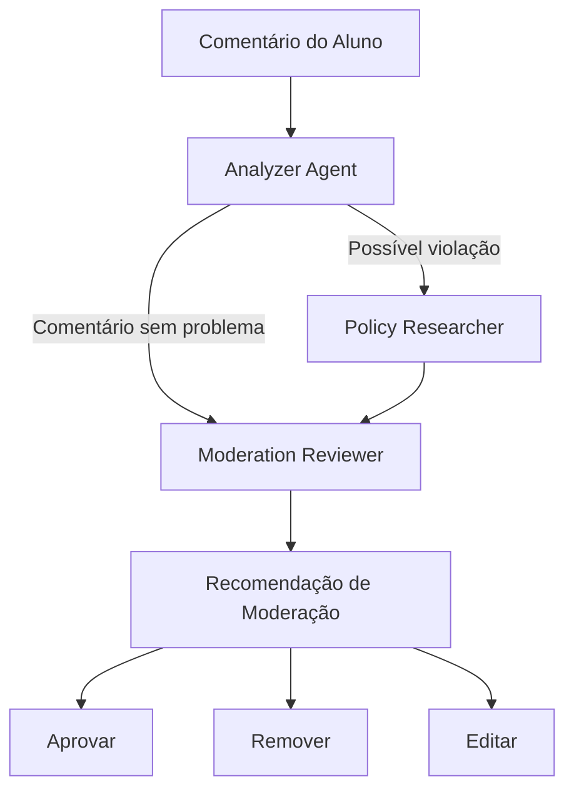
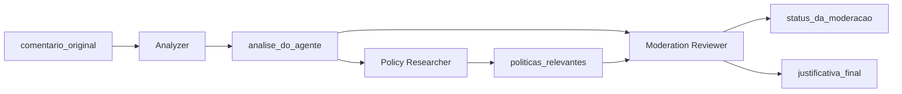

# Arquitetura Inicial dos Agentes

## Diagrama de Arquitetura

O diagrama abaixo representa o fluxo conceitual da primeira versão da arquitetura de agentes.



---

## Fluxo Simplificado

```text
Comentário do Aluno
        │
        ▼
┌─────────────────────┐
│   Analyzer Agent    │
│                     │
│ Analisa comentário  │
└──────────┬──────────┘
           │
           ├─────────────── Sem problema ───────────────┐
           │                                             │
           │                                             ▼
           │                                  ┌─────────────────────┐
           │                                  │ Moderation Reviewer │
           │                                  └──────────┬──────────┘
           │                                             │
           │ Possível violação                           │
           ▼                                             │
┌─────────────────────┐                                  │
│ Policy Researcher   │                                  │
│                     │                                  │
│ Pesquisa políticas  │                                  │
└──────────┬──────────┘                                  │
           │                                             │
           └─────────────────────────────────────────────┘
                                                         │
                                                         ▼
                                             ┌─────────────────────┐
                                             │ Recomendação        │
                                             │ de Moderação        │
                                             └──────────┬──────────┘
                                                        │
                                      ┌─────────────────┼─────────────────┐
                                      ▼                 ▼                 ▼
                                  Aprovar            Remover            Editar
```

## Responsabilidade de Cada Etapa

| Etapa | Componente          | Responsabilidade                      |
| ----- | ------------------- | ------------------------------------- |
| 1     | Analyzer            | Analisar o comentário                 |
| 2     | Policy Researcher   | Pesquisar políticas quando necessário |
| 3     | Moderation Reviewer | Consolidar evidências                 |
| 4     | Recommendation      | Gerar ação recomendada                |
| 5     | Decision            | Aprovar, remover ou editar            |

## Observação Arquitetural

Neste estágio, o diagrama representa o **fluxo conceitual dos agentes**.

A implementação da orquestração através do `StateGraph`, incluindo:

* nós;
* arestas;
* roteamento condicional;
* checkpoints;
* persistência;
* interrupções;
* Human in the Loop;

será implementada posteriormente na **Milestone 3 — LangGraph Workflow Implementation**.

Portanto, este diagrama não representa ainda a implementação final do LangGraph, mas estabelece o contrato arquitetural que será utilizado para construí-lo.


# Fluxo de Comunicação entre os Agentes

## Visão Geral

Os agentes do sistema não se comunicam diretamente entre si através de chamadas acopladas.

A comunicação ocorre através de um **estado compartilhado**, representado pelo `AgentState`.

Cada agente:

1. recebe o estado atual;
2. lê as informações necessárias;
3. executa sua responsabilidade;
4. atualiza somente os campos sob sua responsabilidade;
5. retorna o estado atualizado para a próxima etapa.

Esse modelo permite que os agentes permaneçam independentes enquanto o workflow controla a sequência de execução.

---

# AgentState

O `AgentState` representa o contrato de comunicação entre os componentes do sistema.

A estrutura conceitual é:

```python
class AgentState(TypedDict):
    comentario_original: str
    politicas_relevantes: str
    analise_do_agente: str
    status_da_moderacao: str
    justificativa_final: str
```

O estado será expandido conforme novas capacidades forem adicionadas ao sistema.

---

# Fluxo de Dados

O fluxo de comunicação pode ser representado da seguinte forma:



---

# 1. Entrada do Sistema

O fluxo começa com o comentário enviado pelo aluno.

```text
comentario_original
```

Exemplo:

```text
"Este curso foi excelente e consegui aplicar o conteúdo no meu projeto."
```

O comentário é armazenado no `AgentState`.

---

# 2. Comunicação com o Analyzer

O `Analyzer` recebe o estado contendo o comentário original.

### Entrada

```text
comentario_original
```

### Processamento

O agente analisa o conteúdo procurando sinais de:

* conteúdo positivo;
* conteúdo neutro;
* spam;
* linguagem ofensiva;
* linguagem inadequada;
* possíveis violações.

### Saída

O resultado é armazenado em:

```text
analise_do_agente
```

Exemplo:

```text
"Comentário classificado como positivo ou neutro."
```

O `Analyzer` não modifica o comentário original.

---

# 3. Comunicação com o Policy Researcher

Quando a análise indica uma possível violação, o `Policy Researcher` recebe o estado atualizado.

### Entrada

```text
comentario_original
analise_do_agente
```

O agente utiliza essas informações para determinar o contexto da pesquisa.

### Processamento

O pesquisador consulta as políticas relevantes da comunidade.

A implementação atual permite a utilização de uma função de pesquisa desacoplada, preparando a arquitetura para integração com ferramentas como Tavily.

### Saída

O resultado é armazenado em:

```text
politicas_relevantes
```

Exemplo:

```text
"Política de spam: links promocionais não autorizados não são permitidos."
```

---

# 4. Comunicação com o Moderation Reviewer

O `Moderation Reviewer` consolida as informações produzidas anteriormente.

### Entrada

```text
analise_do_agente
politicas_relevantes
```

O Reviewer utiliza esses dados para produzir uma recomendação.

### Processamento

O agente avalia:

* classificação do comentário;
* possíveis violações;
* políticas encontradas;
* contexto disponível.

### Saída

O resultado é armazenado em:

```text
status_da_moderacao
justificativa_final
```

Exemplo:

```text
status_da_moderacao:
"Remover"

justificativa_final:
"Comentário identificado como spam de acordo com a política de conteúdo promocional."
```

---

# Contrato de Comunicação

Cada agente possui responsabilidade sobre determinados campos do estado.

| Campo                  | Criado/Atualizado por | Consumido por                |
| ---------------------- | --------------------- | ---------------------------- |
| `comentario_original`  | Entrada do sistema    | Analyzer / Policy Researcher |
| `analise_do_agente`    | Analyzer              | Policy Researcher / Reviewer |
| `politicas_relevantes` | Policy Researcher     | Reviewer                     |
| `status_da_moderacao`  | Reviewer              | Workflow / etapa final       |
| `justificativa_final`  | Reviewer              | Workflow / Human in the Loop |

---

# Princípio de Atualização do Estado

Os agentes devem preservar informações que não são de sua responsabilidade.

Exemplo:

```python
return {
    **state,
    "analise_do_agente": analise,
}
```

Dessa forma, o Analyzer atualiza sua informação sem apagar:

```text
comentario_original
politicas_relevantes
status_da_moderacao
justificativa_final
```

Esse princípio é importante para evitar perda de contexto durante a execução do workflow.

---

# Fluxo Completo

O fluxo conceitual completo é:

```text
                    AgentState
                        │
                        ▼
              comentario_original
                        │
                        ▼
                ┌──────────────┐
                │   Analyzer   │
                └──────┬───────┘
                       │
                       ▼
              analise_do_agente
                       │
                ┌──────┴──────┐
                │             │
             problema       normal
                │             │
                ▼             │
       ┌────────────────┐     │
       │     Policy     │     │
       │   Researcher   │     │
       └───────┬────────┘     │
               │              │
               ▼              │
      politicas_relevantes    │
               │              │
               └──────┬───────┘
                      ▼
             ┌─────────────────┐
             │ Moderation      │
             │ Reviewer        │
             └────────┬────────┘
                      │
              ┌───────┴────────┐
              ▼                ▼
    status_da_moderacao  justificativa_final
```

---

# Comunicação e Acoplamento

A arquitetura utiliza o `AgentState` como mecanismo de comunicação para evitar dependências diretas entre agentes.

O Analyzer não precisa conhecer a implementação do Policy Researcher.

O Policy Researcher não precisa conhecer a implementação do Reviewer.

O Reviewer não precisa conhecer a implementação interna dos agentes anteriores.

O workflow é responsável por conectar essas etapas.

Isso permite substituir ou evoluir um agente individual sem modificar toda a arquitetura.

---

# Preparação para LangGraph

Esse modelo de comunicação é especialmente adequado para o LangGraph.

No workflow futuro:

```text
StateGraph
    │
    ├── Analyzer
    │
    ├── Policy Researcher
    │
    └── Moderation Reviewer
```

Cada nó receberá o estado compartilhado e retornará suas atualizações.

O LangGraph será responsável por:

* controlar a sequência;
* executar os nós;
* realizar roteamento condicional;
* persistir checkpoints;
* permitir interrupções;
* retomar execuções;
* suportar Human in the Loop.

---

# Evolução do Estado

O `AgentState` atual representa apenas a primeira versão do contrato.

Durante as próximas milestones, poderão ser adicionados campos como:

```text
moderador_decisao
intervencao_humana
timestamp
agent_metadata
execution_id
confidence_score
policy_sources
```

Essas extensões serão introduzidas conforme novas necessidades do sistema forem implementadas.

---

# Critérios de Conclusão

* [x] Comunicação entre agentes documentada
* [x] `AgentState` documentado
* [x] Entrada e saída de cada agente documentadas
* [x] Responsabilidade sobre cada campo definida
* [x] Fluxo de dados documentado
* [x] Princípio de preservação do estado documentado
* [x] Preparação para integração com LangGraph documentada

---

**Autor:** Vagner Ferreira
**Versão:** 1.0
**Projeto:** Content Moderation Agent System
