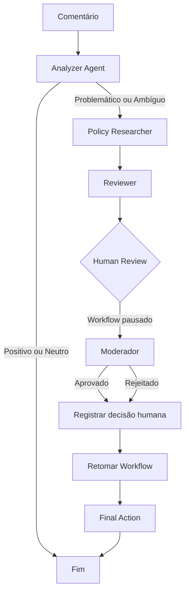

# Human in the Loop Architecture

## Informações do Documento

**Projeto:** Content Moderation Agent System
**Módulo:** Architecture
**Documento:** Human in the Loop Architecture
**Autor:** Vagner Ferreira
**Versão:** 1.0
**Status:** Implementado

---

# 1. Objetivo

Este documento descreve a arquitetura de **Human in the Loop (HITL)** utilizada no **Content Moderation Agent System**.

O objetivo é permitir que decisões de moderação que exigem validação humana sejam interrompidas antes da execução da ação final.

A arquitetura garante que:

* o agente possa realizar uma recomendação automática;
* o workflow possa ser pausado antes da ação final;
* o estado da execução seja persistido;
* um moderador possa analisar o contexto;
* a decisão humana seja registrada;
* o workflow possa ser retomado posteriormente;
* a decisão humana permaneça disponível no estado final.

---

# 2. Motivação

Sistemas de moderação automatizada podem tomar decisões incorretas quando o contexto de um comentário é ambíguo ou quando as regras disponíveis não são suficientes para determinar uma ação com segurança.

Por esse motivo, o sistema utiliza uma arquitetura híbrida:

```text
Automação
    +
Regras de Moderação
    +
Persistência de Estado
    +
Intervenção Humana
```

O agente realiza a análise inicial e produz uma recomendação.

Quando necessário, o workflow é interrompido para que um moderador possa validar ou rejeitar essa recomendação.

---

# 3. Visão Geral da Arquitetura

O fluxo principal de moderação é:

```text
Comentário
    │
    ▼
┌─────────────────────┐
│   Analyzer Agent    │
└──────────┬──────────┘
           │
           ▼
┌─────────────────────┐
│ Policy Researcher   │
└──────────┬──────────┘
           │
           ▼
┌─────────────────────┐
│      Reviewer       │
└──────────┬──────────┘
           │
           ▼
┌─────────────────────────────┐
│     Human Review Point      │
│                             │
│  Workflow interrompido      │
└────────────┬────────────────┘
             │
       decisão humana
             │
       ┌─────┴─────┐
       ▼           ▼
   Aprovado     Rejeitado
       │           │
       └─────┬─────┘
             │
             ▼
┌─────────────────────┐
│    Final Action     │
└─────────────────────┘
```

---

# 4. Componentes

## 4.1 Analyzer Agent

Responsável pela análise inicial do comentário.

Atualmente utiliza regras determinísticas baseadas em palavras-chave e indicadores de ambiguidade.

O agente pode identificar:

* conteúdo potencialmente problemático;
* linguagem ofensiva;
* spam;
* comentários potencialmente ambíguos;
* comentários positivos ou neutros.

Exemplo:

```text
"Compre agora! Isso é spam."
```

Resultado:

```text
Comentário potencialmente problemático detectado.
```

Exemplo de comentário ambíguo:

```text
"Talvez seja uma promoção, mas não tenho certeza."
```

Resultado:

```text
Comentário potencialmente ambíguo detectado.
```

---

# 5. Policy Researcher

O `Policy Researcher` consulta as políticas relevantes para o comentário identificado pelo Analyzer.

Comentários potencialmente problemáticos ou ambíguos são encaminhados para esta etapa.

Para comentários ambíguos, o sistema registra uma política indicando que a decisão deve ser encaminhada para revisão humana.

Exemplo:

```text
Política interna: conteúdo ambíguo deve ser
encaminhado para revisão humana antes da decisão final.
```

A implementação mantém a integração de pesquisa desacoplada por meio de uma função de pesquisa injetável.

Isso permite:

* testes determinísticos;
* substituição futura da ferramenta de pesquisa;
* integração com serviços externos;
* evolução para mecanismos baseados em LLM.

---

# 6. Reviewer

O `Reviewer` utiliza:

* comentário original;
* análise do agente;
* políticas relevantes.

A partir dessas informações, produz uma recomendação de moderação.

Exemplos:

```text
Remover
```

```text
Editar
```

```text
Aprovado
```

A recomendação ainda não representa necessariamente a decisão definitiva.

Quando o Human-in-the-Loop está habilitado, o moderador possui a oportunidade de validar ou rejeitar essa recomendação.

---

# 7. Human Review Point

O ponto de intervenção humana ocorre antes da execução da ação final.

O workflow é compilado utilizando:

```python
interrupt_before=["executar_acao_final"]
```

Isso significa que o LangGraph executa todas as etapas anteriores, mas interrompe a execução antes do nó responsável pela ação final.

O estado permanece disponível para inspeção.

---

# 8. Estado Durante a Pausa

Durante a interrupção, o estado compartilhado contém as informações produzidas pelas etapas anteriores.

Exemplo:

```python
{
    "comentario_original": "...",
    "politicas_relevantes": "...",
    "analise_do_agente": "...",
    "status_da_moderacao": "...",
    "justificativa_final": "...",
    "decisao_humana": "",
    "observacao_humana": "",
}
```

O moderador pode utilizar esse estado para compreender:

1. qual comentário foi analisado;
2. qual análise foi produzida;
3. quais políticas foram consideradas;
4. qual recomendação foi produzida;
5. qual decisão deve ser tomada.

---

# 9. Persistência do Estado

O sistema utiliza um **checkpointer SQLite** para persistir o estado do workflow.

Cada execução possui um identificador de thread.

Exemplo:

```text
thread_id
    │
    ▼
SQLite Checkpointer
    │
    ├── Estado antes da pausa
    ├── Estado durante a revisão
    └── Estado após a retomada
```

Essa arquitetura permite que o workflow seja interrompido sem perder o contexto da execução.

A persistência também permite reutilizar o mesmo `thread_id` para continuar uma execução anteriormente pausada.

---

# 10. Decisão Humana

A decisão humana é registrada diretamente no estado do workflow.

São utilizados dois campos principais:

```python
"decisao_humana"
```

e

```python
"observacao_humana"
```

Exemplo de aprovação:

```python
{
    "decisao_humana": "aprovado",
    "observacao_humana": (
        "Recomendação aprovada pelo moderador."
    ),
}
```

Exemplo de rejeição:

```python
{
    "decisao_humana": "rejeitado",
    "observacao_humana": (
        "Moderador rejeitou a recomendação automática."
    ),
}
```

---

# 11. Retomada do Workflow

Após registrar a decisão humana, o workflow pode ser retomado utilizando o mesmo contexto de execução.

Exemplo conceitual:

```python
workflow.update_state(
    config,
    {
        "decisao_humana": "aprovado",
        "observacao_humana": (
            "Recomendação aprovada pelo moderador."
        ),
    },
)

workflow.invoke(
    None,
    config=config,
)
```

A utilização do mesmo `config` garante que o workflow continue associado ao mesmo `thread_id`.

---

# 12. Fluxo de Execução

O fluxo completo pode ser representado da seguinte forma:

```text
                    ┌──────────────┐
                    │   Comentário │
                    └──────┬───────┘
                           │
                           ▼
                  ┌─────────────────┐
                  │ Analyzer Agent  │
                  └────────┬────────┘
                           │
                  ┌────────▼────────┐
                  │ Análise inicial │
                  └────────┬────────┘
                           │
             ┌─────────────┴─────────────┐
             │                           │
             ▼                           ▼
       Positivo/Neutro          Problemático/Ambíguo
             │                           │
             ▼                           ▼
            END                ┌──────────────────┐
                               │ Policy Researcher│
                               └────────┬─────────┘
                                        │
                                        ▼
                               ┌──────────────────┐
                               │     Reviewer     │
                               └────────┬─────────┘
                                        │
                                        ▼
                              ┌────────────────────┐
                              │    HUMAN REVIEW    │
                              │                    │
                              │ Workflow pausado  │
                              └─────────┬──────────┘
                                        │
                               decisão humana
                                        │
                              ┌─────────┴─────────┐
                              │                   │
                              ▼                   ▼
                         Aprovado             Rejeitado
                              │                   │
                              └─────────┬─────────┘
                                        │
                                        ▼
                               ┌─────────────────┐
                               │  Final Action   │
                               └─────────────────┘
```

---

# 13. Diagrama Mermaid

A arquitetura também pode ser representada utilizando Mermaid:



---

# 14. Por que a intervenção ocorre antes da ação final?

A intervenção humana foi posicionada imediatamente antes da ação final para separar:

```text
Análise
```

de:

```text
Execução
```

Essa separação é uma decisão arquitetural importante.

O sistema pode executar análises e produzir recomendações automaticamente, mas a ação que altera o resultado da moderação pode exigir validação humana.

Isso reduz o risco de que uma recomendação incorreta seja aplicada automaticamente.

---

# 15. Tratamento de Comentários Ambíguos

Comentários ambíguos representam um caso especial.

O Analyzer identifica indicadores como:

```text
talvez
não tenho certeza
pode ser
não sei se
parece
aparentemente
possivelmente
```

Quando esses indicadores são encontrados, o comentário recebe a classificação:

```text
Comentário potencialmente ambíguo detectado.
```

O workflow então segue para:

```text
Policy Researcher
        ↓
Reviewer
        ↓
Human Review
```

Isso permite que o sistema trate incerteza explicitamente em vez de assumir automaticamente uma decisão.

---

# 16. Preservação do Comentário Original

A arquitetura garante que a intervenção humana não altere o conteúdo original recebido pelo sistema.

O campo:

```python
comentario_original
```

é preservado durante todo o workflow.

Essa propriedade é importante para:

* auditoria;
* rastreabilidade;
* investigação de decisões;
* comparação entre recomendação automática e decisão humana;
* futuras análises de qualidade.

---

# 17. Cenários Validados

A implementação possui testes específicos para diferentes cenários de Human-in-the-Loop.

### Aprovação

O moderador aprova a recomendação produzida pelo sistema.

Resultado esperado:

```text
decisao_humana = aprovado
```

A recomendação original permanece preservada.

---

### Rejeição

O moderador rejeita a recomendação automática e registra sua própria decisão.

Resultado esperado:

```text
decisao_humana = rejeitado
```

O estado final mantém a decisão humana.

---

### Comentário Ambíguo

Um comentário sem classificação claramente problemática é identificado como potencialmente ambíguo.

O workflow:

```text
Analyzer
    ↓
Policy Researcher
    ↓
Reviewer
    ↓
Human Review
```

é executado e interrompido antes da ação final.

---

### Preservação do Comentário Original

A decisão humana não deve modificar:

```python
comentario_original
```

O valor deve permanecer exatamente igual ao conteúdo recebido inicialmente.

---

### Estado Final Completo

Após a retomada do workflow, o estado final deve preservar as informações relevantes:

```text
comentario_original
analise_do_agente
politicas_relevantes
status_da_moderacao
justificativa_final
decisao_humana
observacao_humana
```

---

# 18. Benefícios Arquiteturais

A implementação de Human-in-the-Loop fornece:

### Segurança

Reduz decisões automáticas incorretas em situações de incerteza.

### Auditabilidade

Mantém o histórico da análise e da decisão humana.

### Persistência

Permite interromper e retomar workflows.

### Rastreabilidade

Cada execução pode ser associada a um `thread_id`.

### Flexibilidade

Permite substituir regras determinísticas por LLMs futuramente.

### Controle Humano

Mantém o ser humano responsável pela decisão final em cenários críticos.

---

# 19. Evolução Futura

A arquitetura atual foi projetada para permitir evolução incremental.

Possíveis extensões:

```text
Versão atual
    │
    ├── Regras determinísticas
    ├── SQLite Checkpointer
    └── Human Review
```

Evolução:

```text
LLM Analyzer
    │
    ▼
Policy Retrieval
    │
    ▼
LLM Reviewer
    │
    ▼
Confidence Score
    │
    ▼
Human Review
    │
    ▼
Final Action
```

Também podem ser adicionados:

* score de confiança;
* múltiplos níveis de revisão;
* filas de revisão humana;
* interface web para moderadores;
* histórico de decisões;
* métricas de concordância humano/agente;
* feedback humano para melhoria do agente;
* auditoria estruturada;
* integração com bancos de dados externos.

---

# 20. Decisões Arquiteturais

## Decisão 1 — Pausar antes da ação final

A intervenção humana ocorre antes de `executar_acao_final`.

**Motivo:** permitir que a recomendação seja analisada antes de qualquer efeito final.

---

## Decisão 2 — Persistir o estado

O workflow utiliza checkpointer SQLite.

**Motivo:** permitir pausa, recuperação e retomada da execução.

---

## Decisão 3 — Utilizar thread IDs

Cada execução possui um contexto identificável.

**Motivo:** garantir isolamento entre diferentes workflows.

---

## Decisão 4 — Separar recomendação e decisão

A recomendação do agente e a decisão humana são armazenadas separadamente.

**Motivo:** preservar a rastreabilidade da decisão e permitir analisar divergências entre agente e moderador.

---

## Decisão 5 — Tratar ambiguidade explicitamente

Comentários ambíguos não são automaticamente tratados como aprovados.

**Motivo:** representar incerteza como parte explícita do processo de moderação.

---

# 21. Validação

A implementação foi validada utilizando:

```text
ruff check .
```

Resultado:

```text
All checks passed!
```

A compilação também foi validada:

```text
python -m compileall src
```

Resultado:

```text
Compilation successful.
```

A suíte de testes foi executada com:

```text
pytest
```

Resultado atual:

```text
61 passed
```

Isso confirma o funcionamento dos cenários implementados de Human-in-the-Loop.

---

# 22. Critérios de Conclusão

A arquitetura Human-in-the-Loop é considerada implementada quando:

* [x] Workflow pode ser interrompido antes da ação final.
* [x] Estado da execução é persistido.
* [x] Moderador consegue acessar o estado pausado.
* [x] Decisão humana pode ser registrada.
* [x] Workflow pode ser retomado.
* [x] Aprovação é preservada.
* [x] Rejeição é preservada.
* [x] Comentários ambíguos chegam à revisão humana.
* [x] Comentário original é preservado.
* [x] Estado final permanece completo.
* [x] Testes automatizados passam.
* [ ] Diagrama publicado no README.
* [ ] README atualizado com a arquitetura Human-in-the-Loop.

---

# 23. Conclusão

O **Content Moderation Agent System** utiliza uma arquitetura híbrida na qual agentes automatizados realizam análise, pesquisa e recomendação, enquanto o ser humano permanece responsável pela validação de decisões que exigem maior controle.

A implementação estabelece uma separação clara entre:

```text
Percepção
    ↓
Análise
    ↓
Pesquisa
    ↓
Recomendação
    ↓
Intervenção Humana
    ↓
Decisão
    ↓
Ação
```

Essa abordagem fornece uma base sólida para evoluir o sistema posteriormente para uma arquitetura mais sofisticada baseada em **LLMs, confidence scoring, retrieval, agentes especializados e interfaces de supervisão humana**, sem perder rastreabilidade ou controle sobre as decisões.

---

**Autor:** Vagner Ferreira
**Projeto:** Content Moderation Agent System
**Documento:** Human in the Loop Architecture
**Versão:** 1.0
